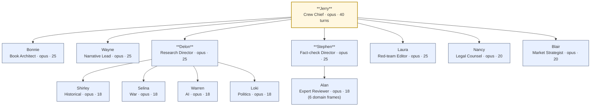

# Crew Portfolio — Who's Responsive for What

A snapshot of the 13-agent crew, organized by cell and dispatch chain.
Every field comes from the canonical source: agent frontmatter,
`scripts/check_agent_graph.py`, `.claude/docs/agent-tool-grants.md`, and
`.claude/rules/03-no-overlap-role-map.md`.

If you only read one section, read **"When you want X, invoke Y"** below.

---

## When you want X, invoke Y

| If you want to… | Invoke | Owner agent | Routes to |
|---|---|---|---|
| Define this sprint's work | `/crew-briefing` | Jerry | leads on demand |
| Build a case file for a named event | `/case-file <event>` | Delon | one of the 4 researchers |
| Audit evidence and source quality | `/source-audit <file>` | Stephen | Alan (with a domain frame) if domain-specific |
| Turn approved case files into a chapter brief | `/chapter-brief <chapter>` | Bonnie | (Wayne after Stephen confirms grades) |
| Attack a thesis, draft, or claim | `/red-team <target>` | Laura | — |
| Build the book proposal pack | `/proposal-pack` | Blair | (Nancy for defamation scan of the pitch) |
| Specialist domain review (ancient ritual / responsibility theory / IHL / AI governance / systems failure / admin law) | Dispatched by Stephen as part of `/source-audit` | Stephen → Alan | — |
| Spec a chart, table, or responsibility-chain diagram | `/figure-spec` | Bonnie | Stephen grades the data, Wayne writes the caption, Nancy clears it if it names anyone |
| Add or clear a photograph | `/photo-clear` | Nancy | researcher sources, Stephen verifies provenance, Wayne captions; compositing is a human production step |

Visual material is evidence and routes through the same gates as prose. Single gate-owners: **Bonnie** specs charts/tables/diagrams; **Nancy** is the go/no-go on photo rights and caption juxtaposition. Full spec: rule `03` "Visual material ownership."

Slash commands live in `.claude/commands/`. Every command has `owner:` frontmatter and dispatches that agent rather than invoking a skill directly.

---

## Dispatch graph (bounded DAG, depth ≤ 2 from Jerry)



The graph is acyclic and depth-bounded. Static check: `scripts/check_agent_graph.py`.

Inside a single invocation, a parent dispatches a child via the `tools: Agent(...)` block in frontmatter. **Handoffs that cross cells propagate via the `Handoff:` schema field in each agent's output, not via nested `Agent()` calls.** The standard chain is asynchronous:

```
researcher  →  Stephen (fact-check)  →  Wayne (draft)  →  Laura (red-team)  →  Nancy (legal)  →  ready
                ↘ Alan (when a domain frame applies)
```

---

## Cells

### Command cell (3 agents)

The shape decisions: what to do this sprint, where it sits in the book, what voice it lands in.

- **Jerry** — `jerry-crew-chief` — coordination, sprint plan, handoff routing
- **Bonnie** — `bonnie-book-architect` — book spine, chapter sequence, case placement
- **Wayne** — `wayne-narrative-lead` — prose, scene construction, audio-readable rhythm

### Evidence cell (5 agents, Delon leads)

The research bench. Delon assigns; researchers execute; outputs flow back via Handoff.

- **Delon** — `delon-research-director` — research system + standards
  - **Shirley** — `shirley-historical-case-researcher` — pre-2000 historical, corporate, financial, industrial cases
  - **Selina** — `selina-war-statecraft-researcher` — Ukraine, Iraq, covert operations, civilian harm
  - **Warren** — `warren-ai-technology-researcher` — AI companies, benchmarks, training data, system cards
  - **Loki** — `loki-public-law-politics-researcher` — Trump administrations, executive orders, agency actions

### Integrity cell (3 agents + Stephen dispatches Alan)

The gates. No claim leaves the cell without an evidence grade. No wording leaves without legal pre-clearance.

- **Stephen** — `stephen-fact-check-director` — verification, A/B/C/D grading, usable/weak/unusable verdicts
  - **Alan** — `alan-expert-reviewer` — six domain frames (ancient ritual / responsibility theory / IHL / AI governance / systems failure / admin/constitutional law)
- **Laura** — `laura-red-team-editor` — adversarial critique, strongest counterargument, bias audit
- **Nancy** — `nancy-legal-risk-counsel` — defamation risk, allegation/finding/conviction wording, permissions

### Market cell (1 agent)

The public-facing surface. Refuses to dilute the thesis for endorsement convenience.

- **Blair** — `blair-market-strategist` — proposal pack, title/subtitle, comp titles, sample-chapter strategy, essay calendar, podcast hooks, launch sequence

---

## Per-agent details

### Direct reports to Jerry (7 agents)

| Agent | Model · Turns | Skills | Dispatches | Trigger (frontmatter) |
|---|---|---|---|---|
| `jerry-crew-chief` | opus · 40 | case-file-method, responsibility-chain-mapping, source-ledger-discipline, chapter-blueprint, evidence-grading, taxonomy-classification, primary-source-playbooks | 7 cell leads | Use when coordinating the whole crew, assigning work, consolidating outputs |
| `bonnie-book-architect` | opus · 25 | chapter-blueprint, responsibility-chain-mapping, counterargument-red-team, taxonomy-classification, scene-construction | — (leaf) | Use when designing the book spine, table of contents, chapter architecture, case hierarchy |
| `wayne-narrative-lead` | opus · 25 | chapter-blueprint, scene-construction, defamation-wording | — | Use when turning approved case files and chapter briefs into readable nonfiction prose |
| `delon-research-director` | opus · 25 | case-file-method, source-ledger-discipline, evidence-grading, primary-source-playbooks | Shirley, Selina, Warren, Loki | Use when designing research assignments, enforcing case-file standards, consolidating source packets |
| `stephen-fact-check-director` | opus · 25 | source-ledger-discipline, evidence-grading, defamation-wording, primary-source-playbooks | Alan | Use when verifying claims, checking quotations, assigning evidence grades |
| `laura-red-team-editor` | opus · 25 | counterargument-red-team, responsibility-chain-mapping, taxonomy-classification, defamation-wording | — | Use when red-teaming the argument, detecting overclaim, exposing category collapse |
| `nancy-legal-risk-counsel` | opus · 20 | citation-hygiene, source-ledger-discipline, counterargument-red-team, defamation-wording | — | Use when reviewing passages involving living people, companies, active litigation, allegations |
| `blair-market-strategist` | opus · 20 | publication-proposal, chapter-blueprint | — | Use when preparing book proposal materials, title/subtitle, comp-title logic, public essays, launch sequencing |

Tool-grant highlights:
- `laura` has **WebSearch + WebFetch** (red-team needs to source the strongest counterargument in real time).
- All 4 researchers + `stephen` + `nancy` + `blair` + `alan` have **WebSearch + WebFetch**.
- No agent has `Bash` or `TodoWrite`. Both are deliberately centralized at the orchestrator session. Policy: `.claude/docs/agent-tool-grants.md`. Static check: `scripts/check_tool_grants.py`.

### Domain researchers (Delon's cell; opus · 18 turns each)

| Agent | Skills | Trigger |
|---|---|---|
| `shirley-historical-case-researcher` | case-file-method, counter-case-method, source-ledger-discipline, evidence-grading, primary-source-playbooks, taxonomy-classification | ancient, medieval, early modern, corporate, financial, industrial cases — and their paired counter-cases |
| `selina-war-statecraft-researcher` | case-file-method, counter-case-method, responsibility-chain-mapping, source-ledger-discipline, evidence-grading, primary-source-playbooks, taxonomy-classification | Ukraine, Iraq, covert ops, proxy warfare, civilian harm, war-crimes records — and their paired counter-cases |
| `warren-ai-technology-researcher` | case-file-method, counter-case-method, responsibility-chain-mapping, source-ledger-discipline, evidence-grading, primary-source-playbooks, taxonomy-classification | AI companies, benchmarks, training data, system cards, AI lawsuits — and their paired counter-cases |
| `loki-public-law-politics-researcher` | case-file-method, counter-case-method, source-ledger-discipline, citation-hygiene, evidence-grading, primary-source-playbooks, taxonomy-classification | Trump administrations, executive orders, agency actions, records fights — and their paired counter-cases |

### Expert reviewer (Stephen's cell; opus · 18 turns)

Alan picks the frame at invocation time and names it at the top of every review memo (`Domain frame: <name>`). Skill set: counterargument-red-team, citation-hygiene, responsibility-chain-mapping, evidence-grading, primary-source-playbooks.

| Domain frame | Authority body | Forbidden overreach |
|---|---|---|
| Ancient ritual / religious studies | Leviticus scholarship, classical philology, historiography methods | No institutional-continuity claims without evidence; no symbolic ritual → modern motive collapse |
| Responsibility theory / legal philosophy | Analytic jurisprudence, moral-responsibility literature | Don't convert conceptual distinctions into legal findings; don't relabel evidence grades to resolve ambiguity |
| International humanitarian law | Geneva Conventions, Additional Protocols, Rome Statute | No "war crime" before procedural stage supports it; no command-responsibility without chain-of-command + knowledge evidence |
| AI governance / technical | Model cards, system cards, benchmark methodology, governance-policy source hierarchy | Don't equate marketing to technical disclosure; don't infer capability from benchmark headlines |
| Complex systems / safety engineering | Major-accident investigation methodology, multi-causal failure chains, defense-in-depth | Don't end causal analysis at operator error when design/procedure/oversight evidence exists |
| Administrative / constitutional law | Administrative Procedure Act practice, constitutional doctrine, current court-status discipline | Don't call agency action illegal without supporting status; don't conflate injunction/stay/vacatur/final merits |

---

## What every agent ends every deliverable with

Per the operating-rules boilerplate (Rule 5: *Handoff cleanly*) and the Default response schema:

```text
Owner: <agent-name> / <agent-title>
Task:
Inputs reviewed:
Output:
Evidence grade:
Assumptions:
Open questions:
Risks:
Handoff:
```

`Handoff:` names the next responsible agent. This is the asynchronous routing channel — the cross-cell handoff happens here, not via nested `Agent()` calls.

The `Assumptions:` field is mandatory and is enforced by `scripts/operating_validators.py` on agent files (label check) and on subagent output transcripts (label + non-empty value check).

---

## Five Over-Rules every agent answers to

Single source: `.claude/rules/00-five-values.md`. Synced into every agent and skill by `scripts/sync_five_over_rules.py`.

1. **Evidence before elegance.** Never improve the story by weakening the evidence.
2. **Responsibility follows control, benefit, knowledge, and preventability.** Do not stop at the most visible actor.
3. **Keep the taxonomy intact.** Distinguish pure scapegoat, partial scapegoat, system/object alibi, cost-bearing goat.
4. **Steelman before judgment.** Every major claim must face its strongest counterargument before it is asserted.
5. **Handoff cleanly.** Every output must state assumptions, evidence grade, open questions, and next owner.

---

## How this portfolio is kept honest

This document is a hand-written snapshot. The structural claims it makes are independently verifiable:

| Claim | Verified by |
|---|---|
| Dispatch graph is acyclic, depth ≤ 2 from Jerry | `scripts/check_agent_graph.py` |
| Every command's `owner:` points at a real agent | `tests/test_command_contracts.py` |
| Tool grants match the policy doc | `scripts/check_tool_grants.py` |
| Five Over-Rules are byte-identical across all generated targets | `scripts/sync_five_over_rules.py --check` |
| Every cell lead has an NLPM test spec | `scripts/check_nlpm_specs.py` |
| Every agent declares `Assumptions:` in its default schema | `tests/test_validate_operating_validators.py` |

Run `python3 -m pytest tests/ -q` from the project root to verify all of the above (currently 51 passing).

If you reshape the crew, update the corresponding generator/checker first; the agent frontmatter is the source of truth and this portfolio is downstream of it.

**Note on the `vocabulary` skill.** It lives at `.claude/skills/vocabulary/` but is not declared in any agent's `skills:` list. It is **NLPM infrastructure**, loaded by `nlpm:score` and `nlpm:check` via the `vocabulary_skill:` field in `.claude/nlpm.local.md`. Agents do not invoke it directly; R51 enforces the registry against every artifact at scoring time.
