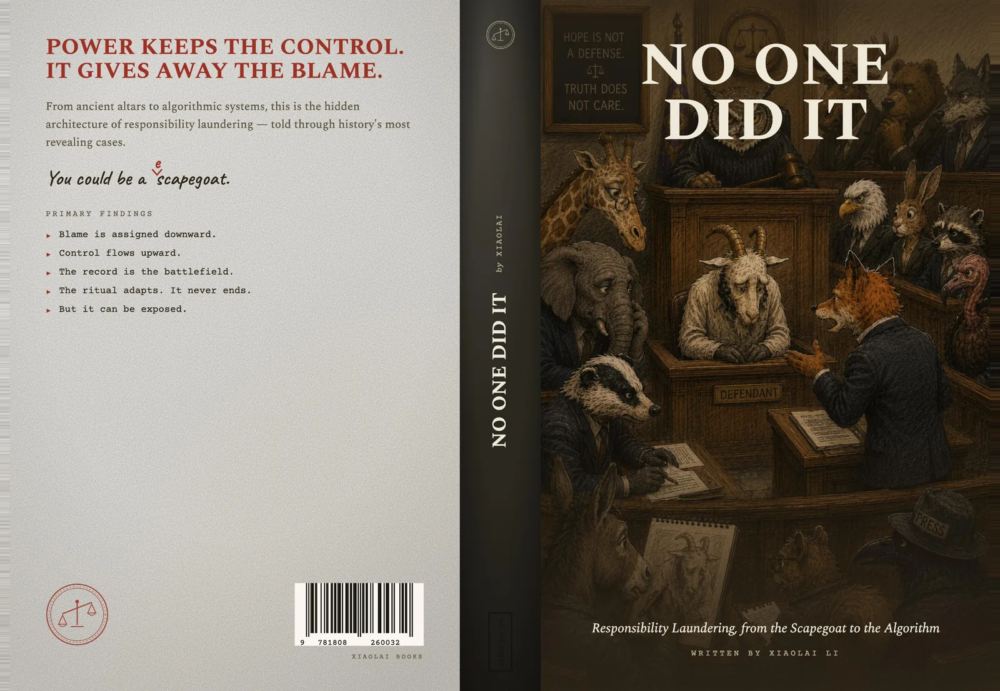

# No One Did It



This repository holds the source of *No One Did It: Responsibility Laundering, from the Scapegoat to the Algorithm* (Xiaolai Books, first edition, 2026; eBook ISBN 978-1-80826-002-5, paperback ISBN 978-1-80826-003-2) — the published manuscript, the 292-card source ledger that backs every cited claim, the 13-agent AI crew that helped build it, and the discipline that holds them together.

Three audiences are in mind.

## If you read the book

The chapter prose, the references, and the primary-document cards behind every cited claim live here. The 13 chapters are in [`book/chapters-v6/`](book/chapters-v6/); start at [`book/evidence/source-ledger/cards/`](book/evidence/source-ledger/cards/) to verify a quote or browse the documents behind a case. This repository holds the **source**, not the packaged editions: the Kindle eBook is sold on [Amazon](https://www.amazon.com/dp/B0H3GDDL6H). Both editions build from the same v6 source — see [Build the editions](#build-the-editions) to regenerate the EPUB and print PDFs yourself.

## If you have not read the book yet

The argument in one paragraph: *Civilization did not stop sacrificing substitutes when it stopped sacrificing goats. It moved the altar — from the temple to the org chart, from the org chart to the legal entity, from the legal entity to the algorithm — and at each move the part where someone announces "this one will carry it for us" went further underground. The book names the move — responsibility laundering — and hands the reader an eight-question diagnostic and four recognizable shapes that walk it back to a name.*

The book opens with the preface ([`book/front-matter/preface.md`](book/front-matter/preface.md)). The Kindle edition is on [Amazon](https://www.amazon.com/dp/B0H3GDDL6H). The author's note on motive, use, and how the book was built is at [`book/back-matter/note-from-the-author.md`](book/back-matter/note-from-the-author.md).

## If you want to build a book this way

The author's note at [`book/back-matter/note-from-the-author.md`](book/back-matter/note-from-the-author.md) explains what the apparatus did and what it could not. The framework itself is the [eou-foundry plugin](https://github.com/xiaolai/eou-foundry); this repository is one application of it. The 13-agent crew, the skills and rules they operate under, the validators that hold the discipline, and the source-ledger pipeline live at [`.claude/`](.claude/), [`scripts/`](scripts/), and [`tests/`](tests/). The EOU-foundry instance state (governance the crew inherits) lives with the [eou-foundry plugin](https://github.com/xiaolai/eou-foundry), not in this repository. To copy the discipline, the note in the back of the book and the [`.claude/rules/`](.claude/rules/) directory are the entry points.

## Layout

```
book/                  canonical text (v6) + evidence + design + cross-chapter registries
  book/chapters-v6/    the 13 chapters
  book/front-matter/   copyright, dedication, epigraph, preface, note-on-cases
  book/back-matter/    references, bibliography, methods, glossaries, author notes
  book/evidence/       source-ledger (292 cards), case-files, diagrams, photos
  book/design/         EPUB metadata + CSS + cover; the 4 part-divider plates
  book/registries/     callback-graph, cognitive-arc, motif-registry, treatment-classes
  book/proposals/      Blair's publication pack
process/               how the book got made — audits, reader-reports, review-memos,
                       defect-maps, rewrite plans (rule 09 lifecycle records)
pipelines/             producers of derived artifacts
  pipelines/epub/      EPUB build (assemble + pandoc + KDP gates)
  pipelines/print/     print-PDF build (Playwright + qpdf + cover composition)
  pipelines/design-studio/  browser-based cover design studio
dist/                  derived output — the KDP EPUB, the interior + cover PDFs,
                       and the manuscript cache (gitignored — regenerated on demand)
dev-docs/               read-only research material (frozen reference)
scripts/               tools and gates that aren't pipelines — sync, validators,
                       source-ledger maintenance, one-off patches
.claude/               the 13-agent crew + skills + rules + hooks
tests/                 the 119-test suite (+32 subtests) that holds the discipline
```

## Build the editions

Both editions regenerate from the v6 source — the `dist/` artifacts are build outputs (gitignored), not the master.

```bash
# Kindle EPUB → dist/no-one-did-it.epub
python3 pipelines/epub/assemble_v6_manuscript.py   # spine-v6.yml → dist/manuscript-v6.md
python3 pipelines/epub/build_kdp_epub.py           # manuscript → EPUB (cover, title, contents)
python3 pipelines/epub/validate_kdp_epub.py        # epubcheck + Kindle Previewer + 6 gates

# KDP paperback → dist/no-one-did-it-{interior,cover}.pdf
cd pipelines/print && node pipeline.mjs            # prose → 6×9 interior PDF + full-wrap cover

# Verify the discipline holds
python3 -m pytest tests/ -q
```

## License

This repository is dual-licensed.

| What | License |
|---|---|
| Prose — everything under `book/chapters-v6/`, `book/front-matter/`, `book/back-matter/`, and any edition built from them (the assembled manuscript, the EPUB, the print PDFs) | [**CC BY-NC 4.0**](https://creativecommons.org/licenses/by-nc/4.0/) — attribution required; no commercial reuse. Quote for review, criticism, scholarship. Do not republish or sell. |
| Apparatus — everything else: `.claude/`, `scripts/`, `pipelines/`, `tests/`, `process/`, `book/evidence/source-ledger/`, `book/registries/`, `book/design/` | [**MIT**](https://opensource.org/license/mit) — copy, adapt, build your own book with it. |

Full license texts are in [`LICENSE`](LICENSE).

## Corrections, evidence challenges, source disputes

Open an issue. The book's evidence-grade discipline applies to corrections too: a correction needs a citation at least as good as the one the book carries. Pull requests against `book/chapters-v6/` are reviewed against the same gates the original chapters passed — `scripts/validate_*.py`, the scan-* hooks, and the same fact-check discipline the crew applied. The corrections record will live in [`CORRECTIONS.md`](CORRECTIONS.md) once any land.

## Author

Li Xiaolai — solopreneur, teacher, writer, learner, investor. See [`book/back-matter/about-the-author.md`](book/back-matter/about-the-author.md), [lixiaolai.com](https://lixiaolai.com), or [github.com/xiaolai](https://github.com/xiaolai).
