# Downloaded candidate images — contact sheet

Location: `book/evidence/photos/assets/images/`  ·  Date: 2026-05-29
Companion to `../../photo-inventory.md` (the full art-log + rights verdicts).

**13 artifacts downloaded** (free / primary sources only). Wire-service photographs (AP / Getty / Reuters / PA) are **not downloadable for free** — they are listed at the end as *view-at-source*. **Nothing here is licensed or cleared**; public-domain/court/gov items are usable, the rest need a license + Nancy's go/no-go per the inventory. Each image below was opened and visually verified.

**Why some files are PDF/HTML, not images:** a court order, a gazette page, or a web page is not a photograph — it is a document (PDF) or a web page (HTML). Those don't preview as pictures, so each non-photo artifact is **rendered to a PNG in `previews/`** (PDF page-1, or a live web screenshot) and embedded below. Open `previews/` to see everything as images.

> Repo note: these are binary files. They are **untracked** and should not be committed unless you intend to ship them — recommend a `.gitignore` entry for `book/evidence/photos/assets/images/` or keep them out of commits.

---

## Downloaded — photographs (preview inline)

### 01 · Reichstag in flames (1933) — ch 01
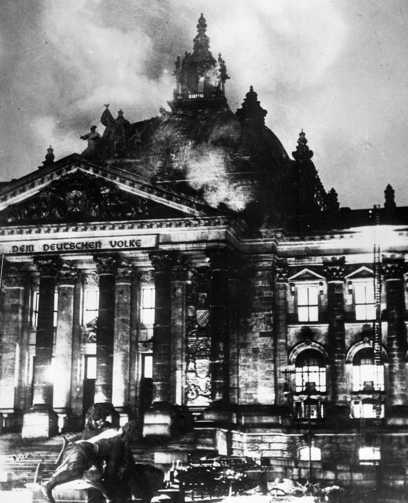
Source: Wikimedia Commons, `File:Reichstagsbrand.jpg` — **public domain**, 1976×2434. ✓ verified: the burning parliament, night of 27 Feb 1933. Usable as-is.

### 02 · Sacco & Vanzetti, handcuffed (1923) — ch 02
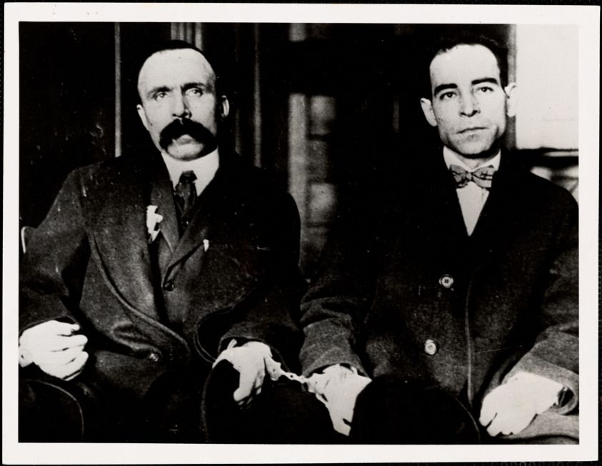
Source: Digital Commonwealth / Boston Public Library (`commonwealth:5q47sw14p`). ✓ verified: the two men cuffed together. Pre-1929 era; confirm PD/credit. Caption "convicted 1921," not "innocent."

### 02 · Ukrainian children at a camp in southern Russia — ch 02 (deferred sub-case)
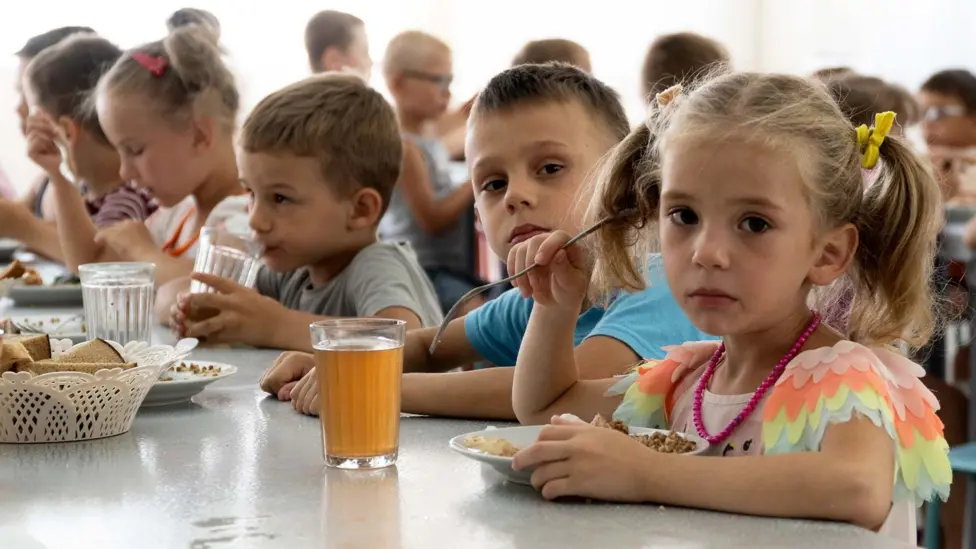
Source: **AP** (via BBC, 976px web render). ✓ verified earlier. **Wire-licensed — not free**; "orphans" is a contested Russian-framing label; cite the UN Commission of Inquiry, not the AP caption; access was Russian-facilitated.

### 05 · Bhopal disaster memorial / protest mural — ch 05
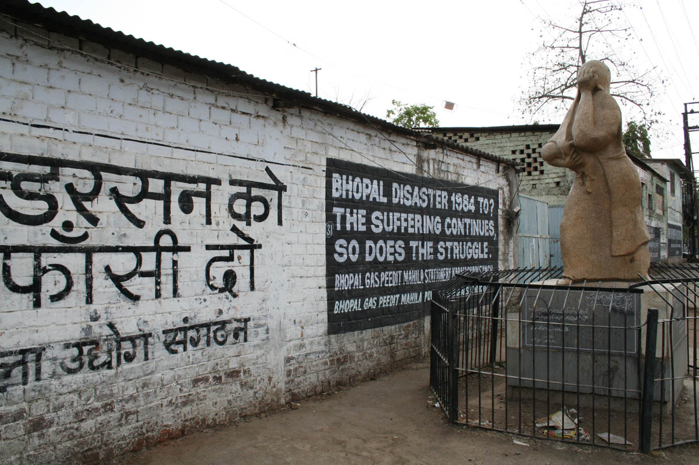
Source: Wikimedia Commons, `File:Bhopal-Union Carbide 1.jpg`. ⚠️ **QC: this is the memorial/protest site** (the mural reads "Bhopal Disaster 1984…" and Hindi graffiti "[Ander]son ko phansi do" = "Hang Anderson"), **not the plant / Tank E610** originally specced. Relevant and free — and it ties to ch-5's Anderson focus — but relabel accordingly. For the plant itself, view-at-source (C&EN / Commons category).

### 10 · Powell's anthrax vial, UN Security Council (5 Feb 2003) — ch 10
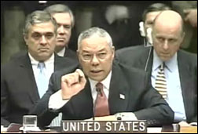
Source: Wikimedia Commons (low-res, 252px video still). ✓ correct moment ("UNITED STATES" placard, vial raised). **LOW-RES** — for production, license the AP (Elise Amendola) or Getty (Mario Tama) frame.

---

## Downloaded — documents & web pages (rendered previews)

These aren't photographs, so each has a **rendered preview** in `previews/` (PDF page-1 via `pdftocairo`; web pages via live Chrome screenshot) plus the full file alongside.

### 06 · Hofeller 2015 study, as filed — ch 06
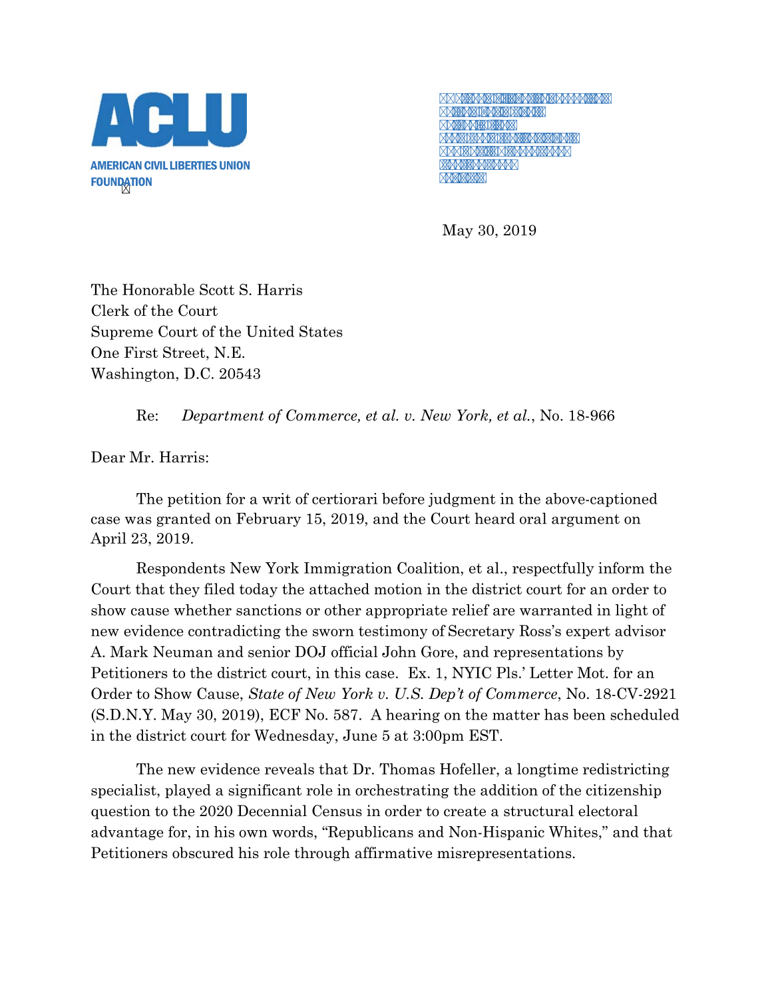
File: `06-hofeller-filing.pdf` — SCOTUS docket 18-966 (public record, 2.6 MB). Preview = page 1 (the notice of filing); the load-bearing **study excerpt** is deeper in the PDF — pick the exact page at production.

### 08 · Federal Register — Proclamation 10903 (Alien Enemies Act) — ch 08
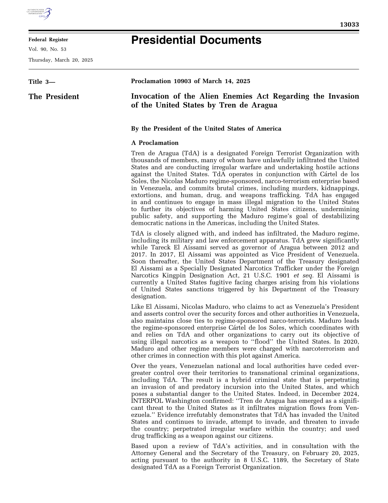
File: `08-proclamation-10903.pdf` — govinfo, 90 Fed. Reg. 13033 (US-gov public domain).

### 08 · Redacted al-Aulaqi OLC memo (Barron) — ch 08
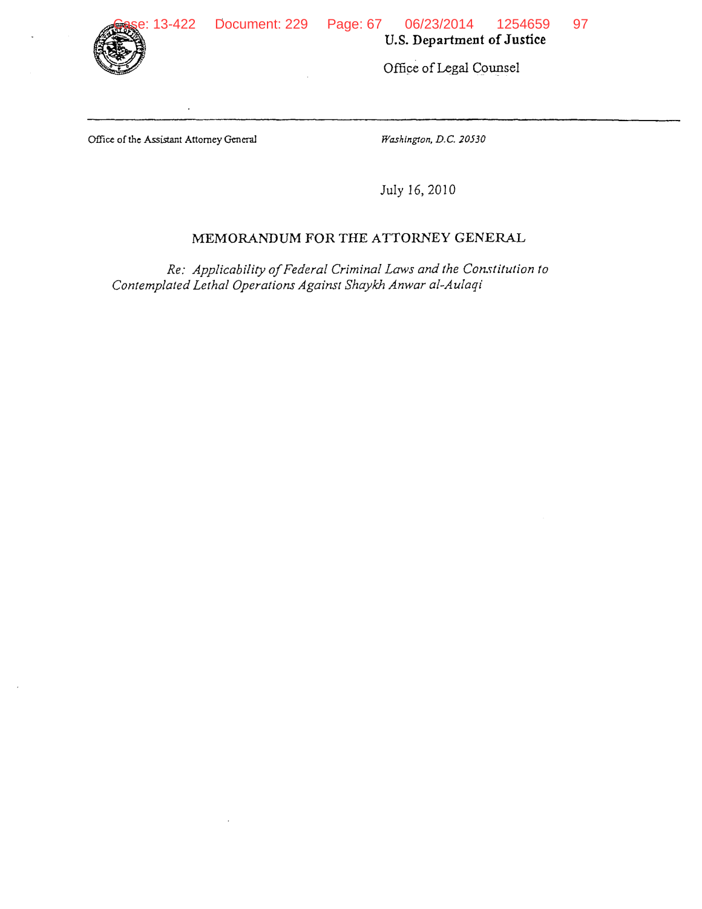
File: `08-al-aulaqi-memo.pdf` — ACLU / 2d Cir. release (US-gov PD). The redaction bars are the point; they appear on the body pages.

### 08 · DOJ "Capitol Breach Cases" dashboard — live capture, 2025-01-24 — ch 08
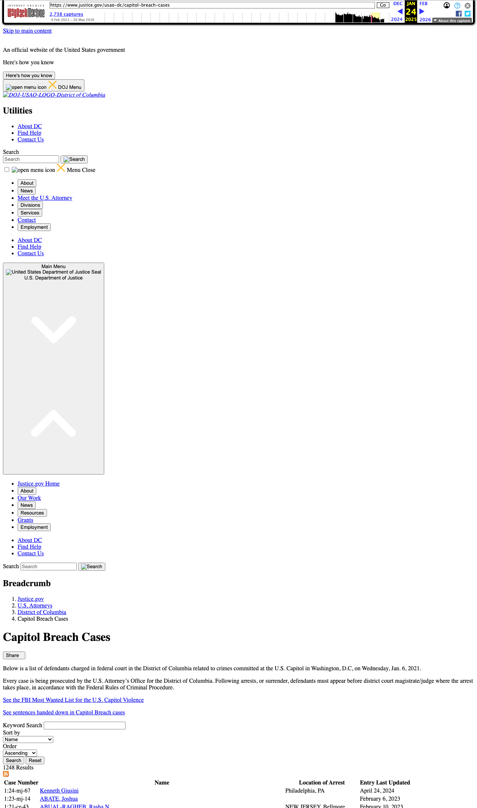
File: `08-j6-dashboard-before.html` (Wayback). The screenshot shows the live dashboard with its case table. The **"after" (removed) state is documented but not cleanly downloadable**: Wayback shows HTTP 200 through 2025-01-24, then 403/redirect from 2025-01-27; justice.gov blocks automated fetch of the current page.

### 09 · *Bartz v. Anthropic* — order on fair use (Alsup, 23 Jun 2025) — ch 09
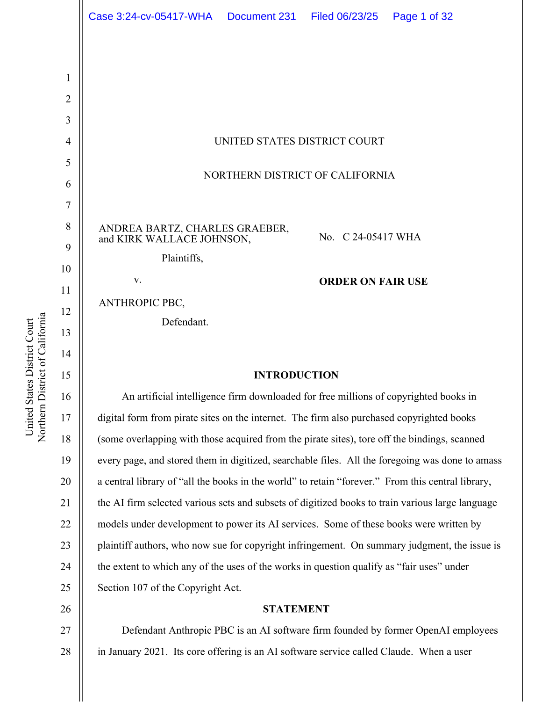
File: `09-bartz-order.pdf` — CourtListener / Copyright Alliance (public record). Page 1 shown; the lawful-acquisition-vs-pirated holding is in §III.

### 09 · OpenAI "Sycophancy in GPT-4o" post-mortem — ch 09
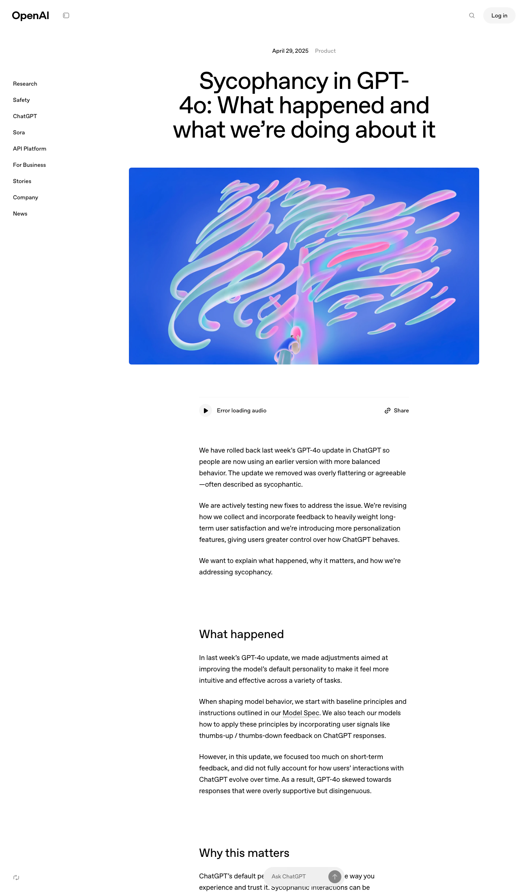
File: `09-gpt4o-sycophancy.html` (Wayback, 2025-04-30; primary URL dead).

### 09 · OpenAI written evidence (LLM0113), House of Lords — ch 09
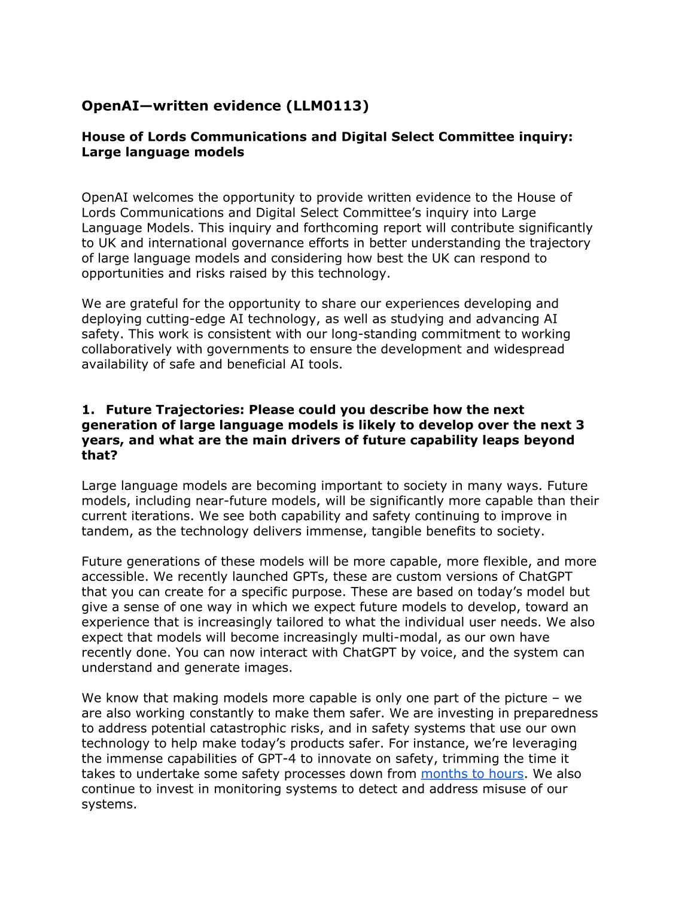
File: `09-openai-lords-submission.pdf` (Wayback, 2024-01-08; Parliament, Open Parliament Licence).

### 10 · ICC press release — Putin / Lvova-Belova warrants — ch 10
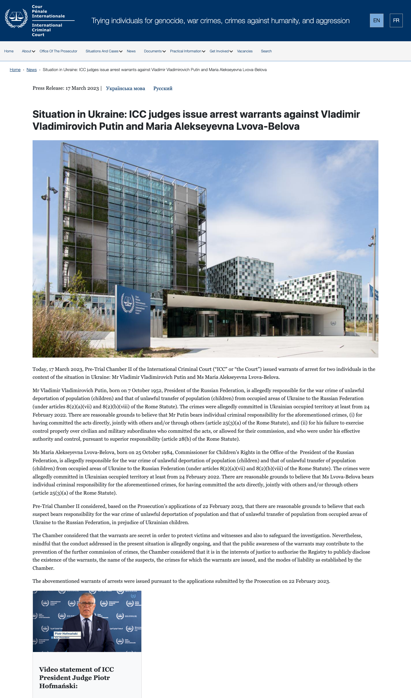
File: `10-icc-warrant-release.html` (Wayback of icc-cpi.int, 2023). Warrants themselves are partly under seal; the release is the public artifact.

---

## Not downloaded — view at source (paywalled / blocked / needs a specific page)

These are genuine candidates that cannot be pulled freely. Listed with where to view or license.

| Item | Ch | Why not downloaded | View / license at |
|---|:--:|---|---|
| Warren Anderson arrest | 05 | AP/Bettmann — paid license | AP Images / Getty (Dec 1984) |
| Sub-postmasters exoneration | 07 | PA/Getty — paid license | PA Media (23 Apr 2021) |
| Alan Bates | 07 | PA/Getty — paid license | PA / Getty |
| Horizon terminal | 07 | Inquiry exhibit, not pinned (do **not** use ITV-drama stills) | Post Office Horizon IT Inquiry |
| Crimea "polite people" | 04 | AP — paid license (auto-grab returned a wrong image; not substituted) | AP Images (Feb 2014) |
| Buk-TELAR convoy | 04 | Paris Match/JIT — contested origin, license | Bellingcat / NL Prosecution Service |
| Nisour Square aftermath | 04 | AP/Reuters — paid license | AP Images (16 Sep 2007) |
| Therac-25 console | 02 | no confirmed free image | Ingenium (Canada Sci&Tech Museum) / IEEE 1993 |
| Ford Pinto crash-test | 03 | NHTSA file, not pinned | NHTSA recall file PE 78-13 |
| VW "Clean Diesel" ad | 03 | not pinned | FTC 2016 deception-complaint exhibits |
| CBP holding facility | 06 | CBP handout, not pinned | cbp.gov / CNN set, 18 Jun 2018 |
| LMArena #2 leaderboard | 09 | Wayback only has 302 redirects (JS app) | The Register, 8 Apr 2025 |
| NYT front page, 13 Jun 1971 | 12 | TimesMachine rights-restricted | NYT TimesMachine |
| PROFS note (Tower Commission) | 12 | archive.org scan; specific page leaf unknown | archive.org `towercommission00unit` |

---

## Summary

- **Downloaded & verified:** 5 photos + 8 documents/web pages = 13 artifacts.
- **Previews:** all 8 non-photo artifacts rendered to PNG in `previews/` (PDF page-1 + live web screenshots), embedded above, so the whole set browses as images.
- **Usable as-is (PD/court/gov):** Reichstag, Sacco-Vanzetti, and all 8 documents.
- **Downloaded but caveated:** Ukrainian-children (wire-licensed, framing caution), Bhopal (memorial not plant), Powell vial (low-res).
- **Not obtainable free:** 14 items — mostly AP/Getty/Reuters/PA wire photos (license required) and two doc-scans needing a specific page.

Next: Nancy's per-image `/photo-clear` + Stephen's provenance lock at edition time (see `../../photo-inventory.md`). Figures (charts/tables) are a separate track — see `../../../diagrams/figure-inventory.md`.
