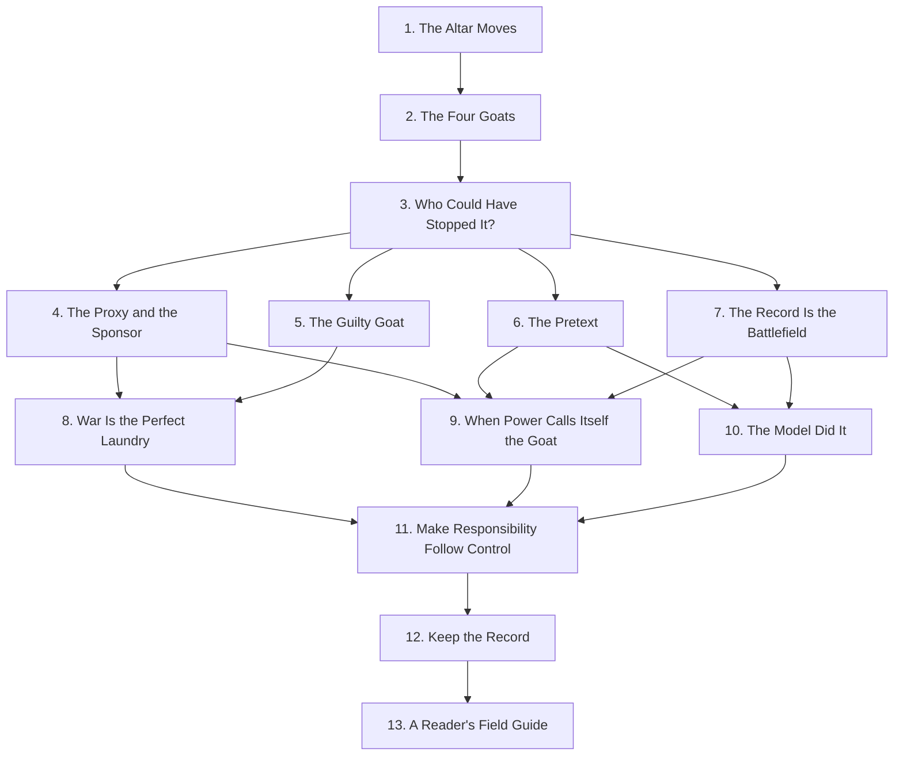

# Spine Proposal — v1

> **Status:** working draft for discussion. **Not committed.** `book/toc.yml` does not yet exist; this file is what will become it once we ratify the structure.
>
> **Author of this draft:** synthesised by Claude from the existing research package (`dev-docs/02_RESEARCH_PACKAGES/.../04_Book_Integration/Chapter_Placement_Proposal.md`, `Cross_Pattern_Matrix.md`, `Book_Grade_Case_Shortlist.md`) plus the thesis and four-category taxonomy in `AGENTS.md` and `.claude/rules/`.
>
> **Date:** 2026-05-25.
>
> **Purpose:** give us something concrete to attack, redirect, and revise. Replace, do not extend.

---

## What the spine is doing

The book argues a thesis (responsibility laundering is the recurring method by which power keeps control while moving blame). It has to do three things in order:

1. Install the diagnostic (eight questions, four-category taxonomy) so the reader has a working tool.
2. Show the diagnostic on patterns that span centuries, so the reader sees pattern, not period.
3. Stress-test on the modern terrain where the reader's prior commitments will fight the analysis (war, partisan politics, AI).

Then close with anti-laundering rules that follow from the diagnostic, not from moral exhortation.

The 13-chapter shape below is the smallest spine that does all three without padding and without skipping a category in Part II.

---

## Spine — 4 parts, 13 chapters

### Part I — The Mechanism (the diagnostic enters)

**1. The Altar Moves.** Opening. Ancient scapegoat ritual → modern blame containers. Reader recognises the pattern they already half-believe. Establishes the central image: civilisation didn't stop sacrificing substitutes, it changed the altar.

**2. The Four Goats.** The taxonomy. One canonical case per category:
- Pure scapegoat — Sacco/Vanzetti *or* Reichstag (decision pending).
- Partial scapegoat — Abu Ghraib MPs, framed at the *plant-level* abstraction.
- System/object alibi — Bhopal "the plant failed" *or* Horizon "the computer says".
- Cost-bearing goat — Ukrainian children *or* separated families.

**3. Who Could Have Stopped It?** The eight-question diagnostic stated cleanly: control / benefit / knowledge / preventability / record / cost. The book's central tool, named and shown working on a small case.

### Part II — The Patterns (the mechanisms named)

Each chapter takes one of the cross-patterns from `Cross_Pattern_Matrix.md` and shows it across centuries.

**4. The Proxy and the Sponsor.** Proxy deniability + legal-person laundering. Crimea, MH17, Blackwater, ancient mercenary practice, modern contractor states.

**5. The Guilty Goat.** Partial scapegoats. A subordinate can be genuinely guilty and still be used to stop blame climbing. Abu Ghraib, Ford Pinto engineers, Boeing 737 MAX pilots, data-labellers.

**6. The Pretext.** Legal/administrative-pretext laundering. Census citizenship question, Ukraine aid hold, impoundment, Zero Tolerance — clean statute recruited after the decision.

**7. The Record Is the Battlefield.** Record-control laundering. PRA challenge, MH17 forensic record, Horizon disclosure fight, DOJ J6 record changes, fake AI citations. *The first anti-laundering device is the record.*

### Part III — The Stress Tests (the patterns held against contested terrain)

These three chapters can be read in any order. Each takes the diagnostic into a domain where the reader's prior commitments will push back.

**8. War Is the Perfect Laundry.** Ukraine/Iraq. Secrecy + chain of command + proxies + national honour + civilian invisibility, all stacking.

**9. When Power Calls Itself the Goat.** Trump I and II as the reverse-scapegoating case. Not partisan spine; institutional stress test for record control, pretext, and the new move where power presents accountability itself as persecution.

**10. The Model Did It.** AI. The newest altar. LMArena/Llama 4, GPT-4o sycophancy, training-data provenance, data-labeller invisibility. Machine and metric as alibis.

### Part IV — The Anti-Laundering Rules (what to do)

**11. Make Responsibility Follow Control.** The four-overlap rule (control + benefit + knowledge + preventability) restated as design principle. How to write contracts, statutes, and AI policies that resist laundering.

**12. Keep the Record.** Institutional design for record durability. Why archives, FOIA, DPAs, audit trails, disclosure regimes are the real anti-laundering machinery.

**13. A Reader's Field Guide.** The eight questions returned to, now as a daily diagnostic for news, court filings, corporate apologies, AI incident reports.

---

## Reading DAG



**Forced order.** 1 → 2 → 3 (taxonomy must be installed before patterns); 11 → 12 → 13 (corrective rules at the end).

**Loose order.** Chapters 4–7 are parallel siblings; chapters 8–10 are parallel siblings. A reader can skip any one stress-test and still land chapter 11 — but the structural argument needs all three present in the book.

---

## Mapping to the existing research

### How the spine consumes the cross-pattern matrix

| Cross-pattern (from `Cross_Pattern_Matrix.md`) | Primary chapter | Echo appearance |
|---|---|---|
| Proxy deniability | 4 | 8 |
| Bad apples / guilty goat | 5 | 8 |
| Legal/administrative pretext | 6 | 9 |
| Record control | 7 | 9, 10 |
| Humanitarian/protection language | 2 (cost-bearing slot) | 6, 8 |
| Metric/benchmark laundering | 10 | 11 |
| Machine/model alibi | 10 | 11 |
| Cost-bearing goat | 2 (taxonomy slot) | 6, 8 |
| Reverse scapegoating | 9 | 11 |

Two patterns (humanitarian language, cost-bearing) appear inside the taxonomy chapter rather than getting their own Part II chapter, because they are *category-defining* rather than mechanism-defining. Pressure-test this: if either deserves a standalone chapter, Part II grows to 5 chapters and Part III may need to lose one stress test.

### How the spine consumes the book-grade case shortlist

| Case (from `Book_Grade_Case_Shortlist.md`) | Chapter |
|---|---|
| Crimea little green men | 4 (anchor), 8 (echo) |
| MH17 shootdown | 7 (anchor), 4 (echo), 8 (echo) |
| Bucha civilian killings and denial | 7 (anchor), 8 (echo) |
| Ukrainian child transfers | 2 (taxonomy anchor), 8 (echo) |
| WMD intelligence | 8 (anchor) |
| Abu Ghraib "bad apples" | 2 (taxonomy anchor), 5 (anchor) |
| Blackwater / Nisour Square | 4 (anchor) |
| ISIS families | 2 (echo), 8 (echo) |
| Family separation | 2 (taxonomy anchor), 6 (anchor) |
| Census citizenship question | 6 (anchor) |
| Ukraine aid hold / first impeachment | 6 (anchor), 9 (echo) |
| 2020 election fraud narrative / Jan 6 | 9 (anchor) |
| Jan 6 pardons + DOJ record scrubbing | 9 (anchor), 7 (echo) |
| DOGE / USAID | 9 (anchor) |
| Mass firing of probationary federal workers | 9 (echo) |
| Alien Enemies Act / Abrego Garcia | 9 (echo) |
| Impoundment / funding-freeze | 6 (echo), 9 (anchor) |
| Presidential Records Act challenge | 7 (anchor), 12 (echo) |
| Meta Llama 4 / LMArena | 10 (anchor) |
| Training-data copyright | 10 (anchor) |
| California training-data transparency | 10 (echo), 7 (echo) |
| GPT-4o sycophancy | 10 (anchor) |
| Grok outputs | 10 (echo) |
| OpenAI Sky voice / ScarJo | 10 (echo, optional) |
| GPT-fabricated scientific papers | 7 (echo), 10 (echo) |
| ByteDance intern / NeurIPS | 10 (echo, optional) |

Coverage is high but not total. Sacco/Vanzetti, Reichstag, Bhopal, Horizon, Boeing 737 MAX, Ford Pinto are *required* historical anchors that are not yet in the shortlist; Delon should commission source packets for them before any chapter brief that depends on them moves to `status: brief`.

### Chapter rhythm fit

Every chapter has to land all eight rhythm beats from `.claude/rules/04-style-guide.md`:

```
1. accusation scene
2. official story
3. hidden architecture
4. older echo
5. record hardens
6. goat resists
7. alibi weakens
8. anti-laundering rule
```

Chapters that will struggle most: chapter 11 (the corrective-rule chapter is structurally argumentative, not narrative — the rhythm needs adaptation, possibly merging beats 1–2 and 6–7). Chapter 13 (field guide is reader-instructional). Both should be drafted only after chapters 1–10 land cleanly, so the rhythm is already proven.

---

## Load-bearing decisions still open

1. **Part II ordering.** Lead with Proxy (clean historical lineage, easiest first pattern) or with Record (most book-central, signals chapter 7's meta-case PRA arc coming)? Current draft leads with Proxy. *Owner: Bonnie.*

2. **Reverse scapegoating as its own chapter.** Currently folded into chapter 9 to avoid bloat. If it grows past one section, it splits and Part III becomes 4 chapters. *Owner: Bonnie + Laura red-team.*

3. **Chapter 13 yes/no.** Either a closing field-guide essay, or fold into 12 and end the book sharper. Decision depends on word count target and audience positioning. *Owner: Blair + Bonnie.*

4. **Opening case.** Ancient ritual is the metaphor field, but the opening *scene* needs choosing — Reichstag (recognition reversal), Sacco/Vanzetti (legal record), or a small ancient ritual fragment (metaphor). Current instinct: ancient ritual → modern echo within the first chapter. *Owner: Wayne, draft-first.*

5. **Whether `system/object alibi` and `cost-bearing goat` deserve standalone Part II chapters.** Currently absorbed into the taxonomy chapter (2). If yes, Part II grows to 6 chapters; Part III may need to drop a stress-test or merge two. *Owner: Bonnie.*

6. **Word count target.** A 13-chapter trade nonfiction book at ~6–7K words per chapter lands around 80–90K, which is the upper edge of trade-general. Blair has not yet weighed in on whether the market reads better at 70K (drop chapter 13 + tighten Part II) or 90K (current shape). *Owner: Blair.*

---

## What this proposal does NOT do

- It does not write `book/toc.yml`. That happens after Bonnie ratifies the structure.
- It does not write chapter briefs. Each chapter still needs `/chapter-brief` once its source packets are graded by Stephen.
- It does not commission new research. The historical anchors flagged as missing (Sacco/Vanzetti, Reichstag, Bhopal, Horizon, Boeing, Pinto) need Shirley to build source packets before chapter briefs depending on them can move forward.
- It does not lock the chapter rhythm against argument-style chapters (11, 13). Adaptation needed; see the Chapter Rhythm section.

---

## How to use this file

1. Mark this file up directly (inline notes) or open a sibling file `spine-proposal-v1-redteam.md` next to it for adversarial review.
2. When the spine is ratified, the agreed version becomes `book/toc.yml` and this dir freezes as a record of how we got there. Subsequent revisions get `v2`, `v3` filenames so the discussion history is auditable.
3. Hand to `bonnie-book-architect` for structural audit (does the reading DAG actually carry the argument, or is a chapter missing?). Hand to `laura-red-team-editor` for attack (what does a hostile reader say about chapter 9 being a Trump-shaped chapter masquerading as a structural one?).

---

## Owner and handoff

```text
Owner: Claude (draft author) → handed to xaiolai for first review
Purpose: ratify the spine before any chapter brief is commissioned
Evidence grade: planning artifact (not an evidence-bearing claim itself; the cases it references retain their own grades)
Assumptions: the four-category taxonomy holds; the eight-question diagnostic is the book's central tool; ~80K trade nonfiction word count
Open questions: see "Load-bearing decisions still open" above (6 items)
Handoff: xaiolai → bonnie-book-architect (structural audit) → laura-red-team-editor (adversarial review) → Bonnie ratifies → book/toc.yml
```
