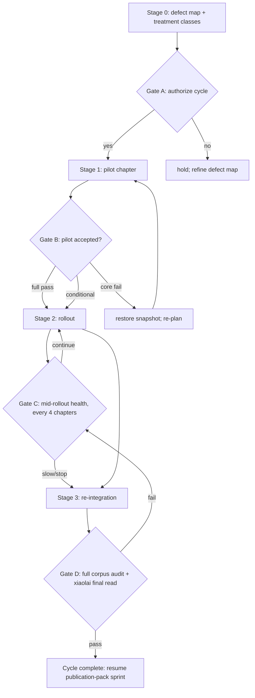

# Fiction-Craft Rewrite — End-to-End Workflow

> **Active governance document** for the fiction-craft rewrite cycle on *No One Did It*. This is the operational workflow that the toolkit (rules 07–12, 9 skills, 3 hooks, 4 data files, fixture suite) was built to execute.
>
> **Drafted:** 2026-05-27
> **Authority chain:** xiaolai (principal author) → jerry-crew-chief (dispatch) → cell leads (Bonnie / Wayne / Stephen / Laura / Nancy / Blair)
> **Companion documents:**
> - `dev-docs/fiction-craft-rewrite-analysis.md` — which moves and which risks
> - `dev-docs/fiction-craft-rewrite-machinery.md` — apparatus design
> - `dev-docs/fiction-craft-rewrite-implementation-plan.md` — phased plan (Codex-reviewed; MAJOR GAPS)
>
> **Governing constraints (from the principal author):**
> 1. Dossier stable — case files in `book/evidence/case-files/` do not move; only prose changes.
> 2. Never go cheap — Path P (polish-only) is off the table; full machinery built and used.
> 3. Boundary chapters (ch-01 / ch-13) rewrite last by the structural-stability principle, since the dossier underneath them is stable.

---

## Workflow overview



---

## Stage 0 — Defect map and treatment classes

**Goal:** answer Codex's "one question" — which chapters fail which reader-experience values — with cited evidence, before authorizing any rewrite.

**Owner:** xiaolai + jerry-crew-chief, executing `/chapter-defect-diagnose`.

**Steps:**

1. For each of the 13 chapters, run:
   ```text
   /chapter-defect-diagnose <n>-<slug>
   ```
   The skill produces `process/defect-map/<n>-<slug>.md` and appends a row to `book/registries/treatment-classes.yml`.

2. Run `/implication-audit` on each chapter as part of the defect-diagnosis. Findings feed the V8 verdict.

3. Review the 13 defect maps as a set:
   - Which chapters share defects?
   - Where does the cross-chapter callback graph likely need adjustment?
   - Which chapters are candidates for the pilot? (Selection rubric in Stage 1.)

4. Confirm treatment classes with xiaolai for ch-01 and ch-13 specifically (per rule 08 + boundary-chapter principle).

**Stage 0 exits when:** `book/registries/treatment-classes.yml` has 13 rows, each with cited defect evidence, each reviewed by xiaolai.

**Cost:** ~13 chapter-audit units (`/chapter-defect-diagnose` is one audit unit per chapter; parallelizable across Bonnie/Wayne for evidence-cite work).

---

## Gate A — Authorize the cycle

**Authority:** xiaolai.

**Inputs:** the 13 defect maps + `book/registries/treatment-classes.yml`.

**Decision shape:**

| Distribution of treatment classes | Decision |
|---|---|
| All 13 are `no-change` | No cycle needed. Publication-pack sprint resumes immediately. |
| Majority `prose-polish` or `no-change`; ≤ 2 chapters at `structural-polish` or `full-craft-rewrite` | Run cycle but skip pilot — go directly to Stage 2 for the small affected set. |
| 3+ chapters at `structural-polish` or higher, OR any `full-craft-rewrite` | Run full cycle: Stage 1 pilot → Gate B → Stage 2 rollout → Gate D. |

**Recorded by:** xiaolai signing off in `book/STATUS.md` under a new "Rewrite cycle authorization" entry.

---

## Stage 1 — Pilot chapter

**Goal:** prove the toolkit works end-to-end on one chapter before book-wide commitment.

**Owner:** jerry-crew-chief dispatches; Wayne writes; Stephen / Laura / Nancy / Bonnie review per their cell responsibilities.

### 1.1 Pilot chapter selection

A chapter is eligible to be the pilot when ALL of:

- Treatment class is `structural-polish` or `full-craft-rewrite` (lower classes do not exercise the full toolkit).
- All anchor claims are A-grade per rule 02 (so prose change is not entangled with evidence change).
- No active Nancy clock within 14 calendar days.
- Not ch-01 or ch-13 (boundary chapters rewrite last per the structural-stability principle).

If 0 chapters are eligible, the toolkit is wrong for this book and Gate A should not have authorized the cycle — escalate to xiaolai for reconsideration.

If 1 chapter is eligible, that is the pilot.

If 2+ are eligible, prefer the one whose defect-map declares the most `fail` verdicts on rule-12 craft values (V2/V4/V6/V9/V10), because the toolkit's distinctive coverage is the craft layer.

### 1.2 Pre-rewrite setup

1. Confirm pilot chapter's row in `book/registries/treatment-classes.yml`.
2. Author `book/chapters-v2/<n>-<slug>.contract.yml` (per template at `book/chapters-v2/_example.contract.yml`):
   - Owner: Wayne
   - Reviewer: Bonnie
3. Verify `pre-edit-chapter-snapshot.py` hook is wired (it is, per `.claude/settings.json`).
4. Flip chapter status: `status: ready → status: in-rewrite`.

### 1.3 Rewrite

Wayne writes the rewrite per the contract. During drafting:

- `scan-overclaim.py` and `scan-implication.py` fire on every save; Wayne resolves warnings inline.
- Wayne self-runs `/implication-audit` after each major scene revision.
- Voice-register tags (`<!-- voice: R-primary -->` etc.) accumulate as Wayne braids registers.
- If the contract needs to change mid-rewrite, run `/contract-change-control` before the change.

Flip status: `in-rewrite → in-review` when Wayne is done.

### 1.4 Audit pass

In order (each step gates the next):

1. **Existing pipeline:**
   - `/audit-chapter` (A2B Engine V2.2)
   - `/evidence-audit`
   - `/fair-clue-audit`
   - defamation-wording sweep
2. **New machinery:**
   - `/contract-audit <n>` — slots delivered?
   - `/voice-register-audit <n>` — distribution and transitions?
   - `/implication-audit <n>` — rule-07 burden cleared?
3. **Cross-chapter (book-wide):**
   - `/callback-audit` — any edges with this chapter as endpoint?
   - `/motif-audit` — appearances list updated?
   - `/cognitive-arc-audit` — discriminations / concepts still installed?
   - `/dependency-check <n>` — blast-radius summary

### 1.5 Independent reviews (rule 03 amendment)

- **Laura:** red-team specifically against rule 12 V1, V3, V8. Laura carries independent veto.
- **Nancy:** review for rule-07 implication surface; rule-12 V7 / V8 on live content. Nancy carries independent veto.

### 1.6 Gate B package

jerry-crew-chief assembles for xiaolai:

- Pre-rewrite and post-rewrite chapter (git diff link).
- All audit memos from 1.4.
- Laura's red-team memo.
- Nancy's clearance memo (or veto, if any).
- Per-value verdict against rule 12's outcome-class table:
  - 5/5 core values pass, ≥3/5 craft positive → **Full pass**.
  - 5/5 core, 1–2 craft positive, declared tradeoff → **Conditional pass**.
  - 5/5 core, 0 craft positive → **Core pass / craft fail** — reject this craft-move set; reclassify or retry.
  - Any core regression → **Core fail** — roll back per rule 09 from snapshot.

### 1.7 Gate B decision

xiaolai reads the package and chooses an outcome class. Recorded in the chapter's audit-history snapshot directory with reason.

**If full or conditional pass:** flip status `in-review → ready`. Stage 1 complete. Proceed to Stage 2.

**If core pass / craft fail:** reclassify the chapter (per rule 08) and re-pilot or accept current state.

**If core fail:** `pre-edit-chapter-snapshot.py` data is the rollback unit. Restore the chapter file and audit reports from `process/audits/history/<n>/<earliest-timestamp>/`. Status returns to `ready` with pre-rewrite content. Diagnose which craft move caused which core regression before any retry.

---

## Stage 2 — Rollout

**Goal:** apply the validated toolkit to every chapter classified above `prose-polish` (except boundary chapters).

**Owner:** jerry-crew-chief dispatches per chapter; same cell roles as Stage 1.

### 2.1 Pre-rollout

Build out the cross-chapter registries (the pilot only required the per-chapter slice):

1. Run `/callback-audit` book-wide on the pre-rewrite corpus to establish baseline. Populate `book/registries/callback-graph.yml` with discovered edges; xiaolai confirms.
2. Run `/motif-audit` book-wide to populate `book/registries/motif-registry.yml`. xiaolai confirms.
3. Run `/cognitive-arc-audit` book-wide to populate `book/registries/cognitive-arc.yml`. Bonnie + xiaolai confirm.
4. Run `/dependency-check baseline` to capture pre-rewrite DAG. Any pre-existing forward dependencies are logged as baseline debt, not blamed on the rewrite cycle.

### 2.2 Chapter sequencing

Order chapters per these rules:

- Boundary chapters (ch-01, ch-13) last.
- Live-content chapters (ch-08, ch-09, ch-10, ch-12 — those with active Nancy clocks per `book/STATUS.md`) interleaved, never clustered.
- Adjacent chapters not back-to-back (so `/dependency-check` has time to surface lateral failures before the next rewrite compounds them).
- High-defect chapters early (so the pilot's audit-calibration learning applies to the highest-leverage rewrites).

### 2.3 Per-chapter cycle (repeated for each chapter)

Identical to Stage 1.2 – 1.7. The cycle steps do not change between pilot and rollout; only the registries are richer in Stage 2.

### 2.4 Gate C — mid-rollout health (every 4 chapters)

After chapters 1, 5, 9 of the rewrite sequence (counted in rewrite order, not chapter number), pause for xiaolai + jerry-crew-chief review:

| Question | If "no" |
|---|---|
| Are post-rewrite chapters reading as the analysis note predicted (inevitability rather than analysis)? | Slow rollout; reconsider craft-move set. |
| Are audits catching real failure modes or false-positive crying wolf? | Tune scanner thresholds; update fixtures. |
| Is Nancy load sustainable? | Reorder live-content chapters; reduce per-cycle Nancy work. |
| Is positioning drifting toward literary nonfiction faster than Blair can re-comp? | Pause Blair's parallel work; consolidate position before continuing. |
| Has any chapter required 3+ contract amendments? | Rule-08 reclassification check; the chapter may be wrong-classed. |

**Output of Gate C:** continue / slow / stop. Stops are recoverable: the rollout pauses and remaining chapters either reclassify down (per rule 08) or stay as-is.

---

## Stage 3 — Re-integration

**Goal:** verify the post-rewrite corpus holds together, then resume the publication-pack sprint.

**Owner:** jerry-crew-chief.

### 3.1 Full corpus audit pass

Run every audit book-wide one more time:

- `/audit-chapter` on all 13.
- `/evidence-audit` on all 13.
- `/fair-clue-audit` book-wide.
- `/callback-audit` book-wide.
- `/motif-audit` book-wide.
- `/cognitive-arc-audit` book-wide.
- `/dependency-check baseline` to confirm no new forward dependencies introduced across the cycle.
- `scripts/sync_five_over_rules.py --check` (Codex flagged this in additional notes — auto-runs as part of `python3 -m pytest tests/ -q`).
- `python3 -m pytest tests/ -q` — all 74+ project tests pass.

### 3.2 Stephen cumulative fact-check delta

Stephen produces a delta against the pre-rewrite source ledger: which citations gained, lost, moved, or graded differently. Any rewrite-caused evidence-grade regression is flagged for Gate D.

### 3.3 Nancy final portfolio sweep

Nancy reviews cumulative defamation surface across all 13 post-rewrite chapters. Replaces the deferred sweep from the original publication-pack sprint. Date-fired Nancy clocks (2026-06-24, 2026-06-25) are re-instantiated against the post-rewrite text.

### 3.4 Blair proposal re-comp

Blair updates `book/proposals/` for any positioning shift caused by the rewrite. Comp titles, sample-chapter strategy, and audience description re-checked.

### 3.5 ch-13 closing sentence

xiaolai writes the closing sentence (placeholder at `book/chapters-v2/13-a-readers-field-guide.md` line 303) against the now-finalized resonant-return chain.

### 3.6 Compile and final read

Two-step pipeline:

1. `/compile-book` produces `dist/no-one-did-it.md` (single-file manuscript with `[CITE: slug]` markers preserved).
2. `python3 scripts/format_citations_chicago.py dist/no-one-did-it.md --output dist/no-one-did-it.chicago.md --report build/chicago-format-stats.json` resolves slugs to Chicago NB endnotes per rule 13.

The Chicago-formatted output is the canonical manuscript: prose with superscript references, back-of-book Notes section grouped by chapter, paired Selected Bibliography. Audiobook export (if produced) strips the Notes section and superscripts and uses only the prose (Layer 1 in-prose source naming carries the source identity for listeners).

Before final read:
- Verify `chicago-format-stats.json` shows zero `missing_slugs`. Any missing slug means a chapter cites a card that doesn't exist; Stephen creates the card or the marker is reverted to `[EVIDENCE NEEDED: ...]` until lock.
- Verify `over_long_brackets` is empty (the `scan-cite-density.py` hook should have caught these at edit time).
- Spot-check 3 endnotes per chapter for Chicago-form correctness; refine card titles if needed (the formatter treats `source.title` as the curated foundation).

Then xiaolai final read against the rule-12 rubric, book-level.

### Gate D — cycle closure

xiaolai signs off. If signs off:

- `book/STATUS.md` updated: cycle complete; publication-pack sprint resumed.
- Audit-history snapshots retained per rule 09.
- Treatment-classes.yml retained as the cycle's permanent record.

If does not sign off, return to Gate C with the specific blocker named.

---

## Kill-switch criteria (rule 03 + rule 09)

The cycle terminates (not pauses; terminates) on any of:

- **3 consecutive Gate B / Gate C failures** with no path forward identified by either jerry-crew-chief OR the relevant cell lead.
- **Laura or Nancy independent veto** that xiaolai does not override within 5 calendar days.
- **Stephen detects a rewrite-caused fact-check regression** that the rewrite cannot be amended to resolve.
- **Codex Test C's specific failure mode:** the same actor (jerry-crew-chief or Wayne) judges "no path forward" three times in the same cycle on the same chapter — interpreted as motivated-reasoning loop; escalate to xiaolai for forced reclassification or termination.
- **xiaolai withdraws Gate A authorization.**

Termination defaults rewritten chapters that passed their Gate B individually to `ready` status (the work is not lost); chapters not yet rewritten remain at their pre-cycle state. Treatment-classes.yml stays in place as a record.

---

## Sprint-impact summary

For the duration of the rewrite cycle, the publication-pack sprint defers:

| Publication-pack item | Effect | Resumes at |
|---|---|---|
| Blair proposal pack | Paused | Stage 3.4 |
| Nancy final portfolio sweep | Paused | Stage 3.3 |
| Manuscript compile | Paused | Stage 3.6 |
| Principal author final read | Paused | Stage 3.6 |
| ch-13 closing sentence | Deferred to last | Stage 3.5 |
| Date-fired Nancy clocks | Re-anchored to post-rewrite text | Stage 3.3 |

---

## Quick-reference: which skill runs when

| Step | Skill | Owner |
|---|---|---|
| Stage 0 per chapter | `/chapter-defect-diagnose` | xiaolai + bonnie |
| Stage 0 per chapter | `/implication-audit` | stephen |
| Pre-rewrite setup | author `*.contract.yml` | wayne + bonnie |
| During rewrite | `scan-overclaim.py`, `scan-implication.py` (auto) | wayne |
| During rewrite | `pre-edit-chapter-snapshot.py` (auto) | hook |
| Mid-rewrite contract change | `/contract-change-control` | wayne + bonnie |
| Post-rewrite audit | `/audit-chapter` + `/evidence-audit` + `/fair-clue-audit` + defamation-wording | stephen |
| Post-rewrite audit | `/contract-audit` + `/voice-register-audit` + `/implication-audit` | stephen |
| Cross-chapter | `/callback-audit` + `/motif-audit` + `/cognitive-arc-audit` + `/dependency-check` | joe |
| Independent veto | `/implication-audit` (against V1/V3/V8) | laura |
| Independent veto | defamation-wording + `/implication-audit` | nancy |
| Re-integration | all of the above, book-wide | joe |

---

## How this resolves Codex's MAJOR GAPS verdict

| Codex finding | Resolution |
|---|---|
| D1#1 Phase 0 forces decisions | Stage 0 explicitly requires xiaolai sign-off on treatment classes; the diagnosis IS the design step, not "neutral inventory." |
| D2#1 No migration plan | Rule 09 + `pre-edit-chapter-snapshot.py` + `process/audits/history/` provide the full migration apparatus. |
| D2#2 Untested skill infrastructure | Fixture suite at `tests/fixtures/implication-audit/` + pytest harness `tests/test_scan_implication_fixtures.py` provide the regression guard. Pattern: extend to every new skill that adds a scanner. |
| D2#3 Rollback underspecified | Rule 09 names the rollback unit (snapshot directory) and the lifecycle. |
| D3#3 Plan in dev-docs | This document lives in `process/plans/`; the analysis/machinery/implementation notes remain in `dev-docs/` as design history. |
| D5#1 Silent evidentiary drift | Rule 07 + `/implication-audit` + `scan-implication.py` + fixture suite. The Blocker. |
| Test C Kill-switch enforceability | Rule 03 amendment adds independent veto for Laura and Nancy with explicit xiaolai-only override; kill-switch criteria above list specific triggers. |
| Test D False R/P binary | Rule 08 five treatment classes replace the binary; Stage 0 assigns per-chapter classes. |
| Test E Boundary chapters last | Honored per the principal-author's structural-stability principle (dossier stable). Stage 3 reserves the final boundary-chapter rewrites for after Stage 2 rollout stabilizes. |
| Test F Gate B sole-judge | Rule 12 provides 10 named values + 4 outcome classes; xiaolai still judges but against measurable criteria. Independent vetoes from Laura and Nancy add structural redundancy. |
| Test G Contract change control | `/contract-change-control` skill + classification of every amendment as discovery / clarification / weakening / strengthening. |
| Test H Blair parallelism feedback | Blair work paused, not parallel; resumes only at Stage 3.4 after rewrite settles. |

---

## Handoff

- **Owner:** jerry-crew-chief.
- **Purpose:** end-to-end operational workflow for the fiction-craft rewrite cycle.
- **Evidence grade:** N/A (procedural).
- **Assumptions:** all rules 00–12 and 9 new skills are in place; hooks fire on edit; fixture suite passes.
- **Open questions:**
  - Voice-register threshold tuning (current default 10%/70%) — calibrate from pilot data.
  - Whether ambient callbacks should be excluded from `/dependency-check` or just from `/callback-audit`.
  - Whether `book/STATUS.md` should expose a per-chapter status column showing `treatment_class:` during a cycle.
- **Handoff:** xiaolai for Gate A authorization. Stage 0 is unblocked; the diagnoses can run regardless of Gate A because the diagnoses ARE the input to the authorization decision.
